# Finding an undiscovered debug/cheat menu unlock code in DID's F-22 Total Air War

F-22 Air Dominance Fighter was released on Steam this week, with a Windows 11-compatible executable, original assets, sadly no HOTAS support at launch (although that is being worked on), and a surprising price of £20.99 - that's about three times the standard price of similar era sims on digital stores.  Someone has vastly overestimated the nostalgia market.

Anyway, while I wait for a GoG release (and deep discount!) of the F-22 ADF rerelease, it made me think about F-22 Total Air War - the promised dynamic campaign expansion pack to ADF that later morphed into a full price sequel within a year.  Specifically, the fact that I couldn't find any mention of how to unlock the debug/cheat mode in the game.

[This post](http://simforums.krishty.com/viewtopic.php?t=50) from Feb 2022 noted that the debug/cheat mode could be enabled in F-22 Air Dominance Fighter by holding `ALT` and typing `D` `I` `D` `I` `T`.  Later, [this post](http://simforums.krishty.com/viewtopic.php?t=1626) from June 2024 noted a similar mechanism for EF2000, this time holding `ALT` and typing `T` `O` `P` `S` `I` `M`.

In the Discord when the EF2000 cheat was found, the locator (Krishty, owner of the linked forum) noted:

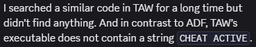

Disheartening.  However, on the forum, another user claimed:

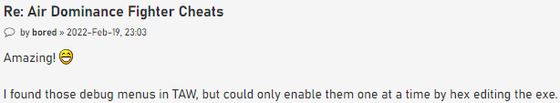

Intriguing!

As a reverse engineer, this piqued my interest.  Apparently the people that have spent years reversing TAW (and whose hard work has been leveraged in the ADF Steam release) couldn't find the TAW debug enabler.  I couldn't locate anything online to suggest anyone knew how to enable it via a typed code.  But some of the functionality still seemed to be present in the exe.  Maybe the enabler was removed at compile time?  Maybe it had been obfuscated but still existed?  Time to find out!

Firstly, I like to reverse applications live via a debugger, but thanks to Microsoft's unwavering commitment to backwards compatibility, the original TAW release doesn't run in Windows 11, and my reversing debugger doesn't run on Windows 9x.  So static analysis is the way forward.  I dig out my TAW big box, spin up a Win95 VM, and install the game:

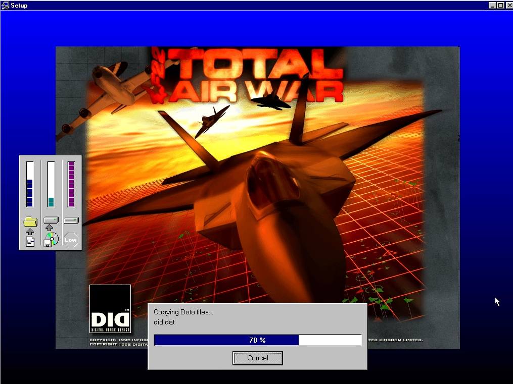

I select Direct3D mode instead of Glide, hoping that this will be more compatible with a vanilla VM install.  A quick check and the game runs.  Then I copy out the f22.dat file to my host PC for some static analysis in IDA (the _f22.exe file is a 35kb stub; f22.dat is a 3,509kb file that is actually a x86 32-bit PE with a different extension, in my case dated 12-Aug-1998).

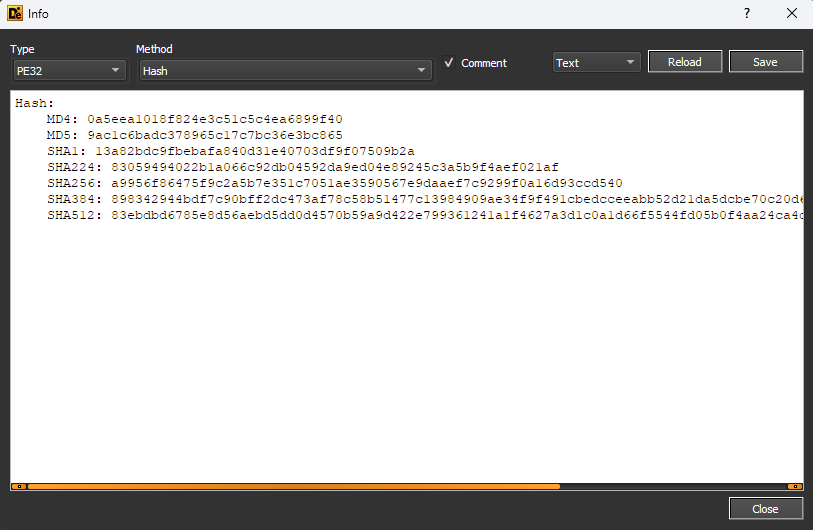

I start by assuming any unlock code would involve holding down ALT and typing in a code, as was the case with EF2000 (`ALT` + `T` `O` `P` `S` `I` `M`) and ADF (`ALT` + `D` `I` `D` `I` `T`), so start looking for key-related functions.  I search strings for "key" and uncover some potentially useful strings like `WM_SYSKEYDOWN` and `WM_SYSKEYUP` that are Windows messages for system keys like ALT being pressed.  [MSDN](https://learn.microsoft.com/en-us/windows/win32/inputdev/wm-syskeydown) says that these events are posted "when the user presses the F10 key (which activates the menu bar) or holds down the ALT key and then presses another key."  I also find some strings that contain `LEFT[RIGHT] WINDOWS KEY TRAPPED!!!!!\n` which could also be useful to narrow down keyboard handling.

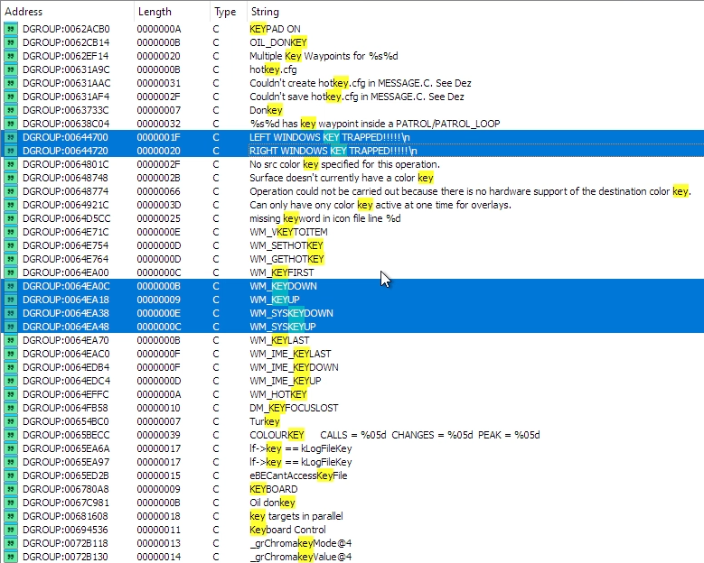

On a hunch, I also filter for "scrn" as one of the ADF debug options saves a screenshot with a filename `SCRNx.LBM`, sure enough `0x62ddc4` contains the string `SCRN%hd.LBM` which should help us narrow down the screenshot function, if it still exists.

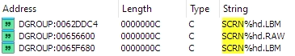

Finally, the EF2000 debug options print strings with flight model info, such as "Pitch", "Angle of attack", "Altitude", "Mach", etc.  Filtering strings for potential format strings containing these terms brings up a number of probable candidates, e.g. `0x630d68` which contains "ALTITUDE %5.0f FT TRUE AIRSPEED: %4.0f KTS RATE OF CLIMB: %5.0f FT PER MIN" - a classic example of a debug format string.

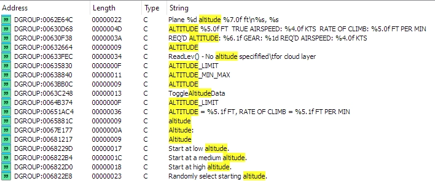

Armed with several attack vectors, I start looking into where these strings are referenced in the code.

I decide to try working in reverse from the screenshot function first, assumming that a) the code still exists, and b) it is still accessed via the Debug/Cheat mode.  I can hopefully work backwards from the filename, to the function that takes the screenshot, to the link back to the input used, and potentially a flag that saves whether the debug/cheat mode is active or not.  Then I can search for where that flag is set, and what the conditions are to enable it.  That's the plan.

The screenshot filename string is only used by `sub_411014`:

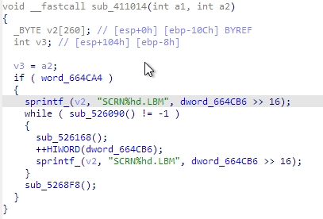

We can immediately see that the top 16 bits of `0x664cb6` (`dword_664cb6 >> 16` or `HIWORD(dword_664cb6)`) seems to be the screenshot count - it calls `sprintf` to insert this value into the `SCRNx.LBM` filename, and increments it in line 13.  It looks like this while loop keeps retrying filenames until it finds a valid one.  We also see the entire function only does something if `0x664ca4` is nonzero, which looks like useful information to note down.

I rename `sub_411014` to `FUN_411014_Save_Screenshot`, and look for what calls it.  It is only called from `sub_412d88`, which is what seems to be a long list of pointers being saved into co-located memory locations, looking a lot like a function pointer table:

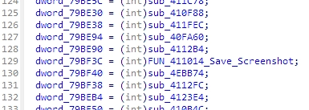

At the top of this function, it has a loop:

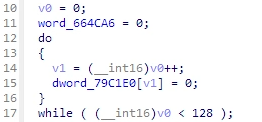

It loops from 0 to 127 (counter variable `v0`) setting `0x79c1e0[i]` to zero.  Then it sets arbitrary values in that 128 item memory range to function pointers.  So `0x79c1e0` seems like a 128 element array of function pointers, where 75 elements are assigned a function pointer and the rest are left null.  Later on in the function it copies the contents of `0x79c1e0` into two new arrays, `0x79bde0[]` and `0x79bfe0[]`, then adds and/or overwrites some of these existing function pointers with new ones.

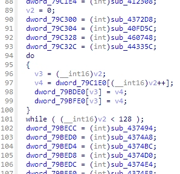

So these three arrays (`0x79c1e0[]`, `0x79bde0[]` and `0x79bfe0[]`) seem to be important function pointer maps, and one of them maps to our screenshot saving function.  Perhaps these are lookup tables for event or keyboard handling?

The only function in which these three arrays are accessed, outside of the initialisation function above, is `sub_412ca0`.

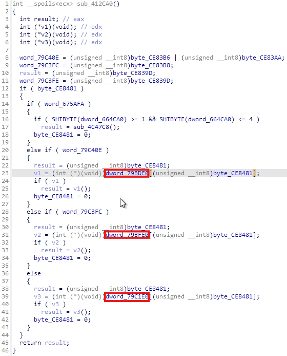

We can clearly see here a pattern:  if `0x79c40e` is nonzero, we index into `0x79bde0[]` using the index `0xce8481`, and if the result is not null, we call the referenced function.  Else, if `0x79c3fc` is nonzero, we do the same into `0x79bfe0[]`, else, we call into `0x79c1e0`.  The index in all cases is `0xce8481`, which is then set to zero after being used, so this is important to find.  And at the top of the function we see that the actual conditions are `(0xce83b6 | 0xce83aa)` for the first check, and `0xce83b8` for the second check.

I do a lot of searching for where `0xce8481`, the index, is used - it's used in a lot of places!  My hunch is that it is an event code or a key index, that is set when the user presses the key combination required to take a screenshot, and this code will use `0xce8481` to find the index in the correct map that then calls the `Save_Screenshot` function.

For clarity, I change `0x79c1e0[]`, `0x79bde0[]` and `0x79bfe0[]` in IDA to be 128 element arrays:

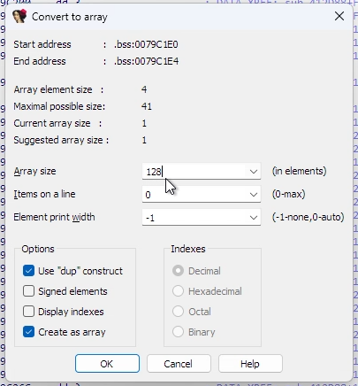

When I do this, IDA tells me that the `Save_Screenshot` function is referenced at index 87 (`0x57`) of `0x79bde0[]`.

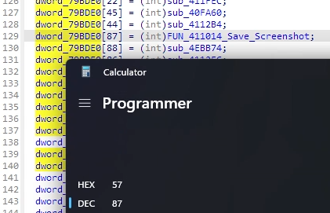

Since we know TAW uses DirectInput (f22.dat imports DINPUT.DLL), we can look up in a [list of DirectInput key codes](https://ionicwind.com/guides/emergence/appendix_a.htm) and see that `0x57` is the code for the `F11` key.  And wouldn't you know it, in the list of previously discovered debug commands for ADF, `SHIFT+F11` takes a screenshot:

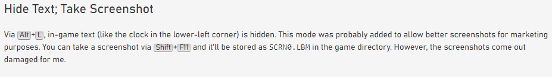

So, it is looking likely that a) the screenshot function is also `SHIFT+F11` in TAW like it was in ADF, b) `0xce8481` stores the DirectInput key code for the key pressed, and c) `0x79bde0[]` is an array of function pointers per key, also indexed by DirectInput code, which applies when the SHIFT key is pressed along with the key in question.

I rename some of the values in `sub_412ca0` above (now renamed `FUN_412CA0_Process_Key_Press`) to reflect what we have learned:

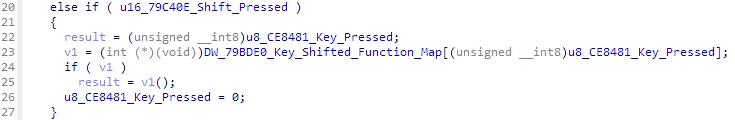

Note that we intuit that the variable tested before accessing the SHIFT function map, `0x79c40e`, is a `Shift_Pressed` flag, which is set:

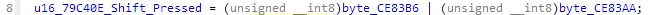

Using these memory locations `0xce83b6` and `0xce83aa`, plus `0xce8481` which stores the key being pressed, and a little (okay, a lot!) of searching, I find the following code in `sub_5307dc`:

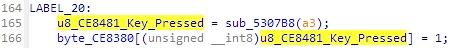

`0xce8380[]` appears to be an array of key press states, with the appropriate index set to 1 if that key is pressed.  Given we know that `0xce8481` contains the DirectInput code of the key being pressed, we can tell IDA that `0xce8380` is an array, rename it to Key_Status, and see how that affects Process_Key_Press:

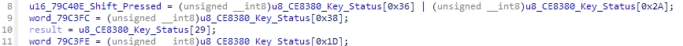

Now we can look up these indices in the DirectInput key map, where we find `0x36` is `RSHIFT`, `0x2a` is `LSHIFT`, `0x38` is `LMENU` (Left ALT), and `0x1d` is `LCONTROL`.  Given these values, we can intuit that `0x79c3fc` is true when ALT is pressed, and so the function pointer map `0x79bfe0[]` must be used for ALT+key commands.  Also, `0x79c1e0` must apply for open keys (i.e. keys pressed when neither SHIFT nor ALT is presssed).  `0x79c3fe` is true when CTRL is pressed, but doesn't seem to be a factor here.  After some further renaming:

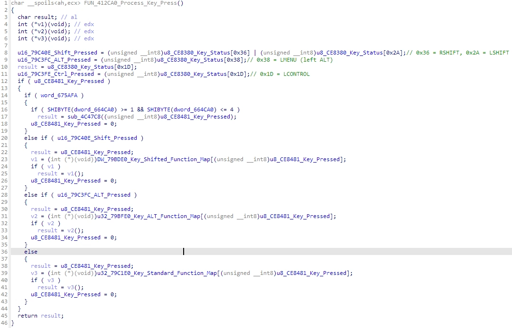

Armed with this info, we could go back to the set up of our function pointer tables in `sub_412d88`, and the index into each of the three function pointer tables will tell us the corresponding key press that calls that function (either open key, SHIFT+key, or ALT+key).  We could then cross-reference that against the Keyboard map in the TAW manual, and we would then know what each of those 136 functions does.  That's a significant attack vector for reversing the game.  However, today I'm interested in figuring out where (if anywhere) the debug/cheat enable code is, which we can narrow down now that we know something about how inputs are processed.

The `Process_Key_Press` function is only called from one place, `sub_413fec`:

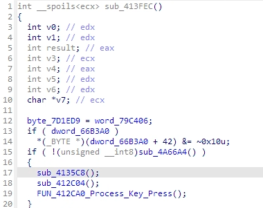

Immediately before, it calls `sub_412c04`, which looks like this:

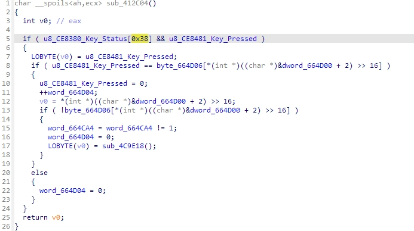

We already know that `0x38` is Left ALT, so line 5 says we only process this function if ALT is down and another key is being pressed, which sounds promising.

Line 8 checks to see if the key being pressed matches the value in an array starting at `0x664d06`, where the index into this array is the top 16 bits of `0x664d02` (i.e. `0x664d04`).

If there is no match, we set `0x664d04` to zero and return.  If it does match, we set the key pressed to zero and increment `0x664d04` by 1.  Note that setting the key pressed status to zero effectively "swallows" the keypress before the next function `Process_Key_Press` tries to process it, which is what we might expect a debug/cheat code function to do.  So `0x664d04` is a counter of how many keypresses have matched the contents of array `0x664d06[]`.  Is `0x664d06` the debug/cheat enable code?

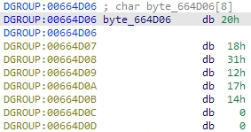

Assuming these are DirectInput key codes, we get: `D` `O` `N` `E` `I` `T` `/0` `/0`

Given the debug/cheat unlock in ADF was to hold down `ALT` and type `D` `I` `D` `I` `T`, it would be a nice touch if the unlock for TAW was updated to `D` `O` `N` `E` `I` `T`!

So let's wrap up with some renaming.  `sub_412c04` is our debug/cheat code checking function.  `0x664d06` is the unlock code.

What does it do when a successful character has been found, in the second half of the checking function, to actually enable the debug/cheat mode?  After increasing the correct character counter, we check the next letter in the unlock code to see if it is null.  If so, we have reached the end of the sequence successfully, so we flip a flag in `0x664ca4` (presumably, a "debug/cheats enabled" flag), reset the correct keypress counter to zero, and call `sub_4c9e18`.  Note that `sub_411014`, the `Save_Screenshot` function, checked `0x664ca4` was true before saving the screenshot, adding further weight that this is a "debug/cheats enabled" flag.

Let's save that and test `DONEIT`, by launching the game, entering a mission, holding `ALT` and typing `D` `O` `N` `E` `I` `T`, then pressing `SHIFT+F11` to see if we get a `SCRNx.LBM` saved in the game folder...

Success!

Trying other codes appears to match the same key commands as ADF, e.g. `ALT+K` shifts time forward by 2 hours.  `ALT+F10` and `ALT+F11` goes through various debug outputs on screen.  `ALT+D` rearms your aircraft.

Here ends a successful static analysis.  We have discovered a debug/cheat unlock code that has until now gone undiscovered, as far as I can tell.  Not bad for a few hours' work.

We have also inadvertently discovered two rich opportunities for further reversing.  Firstly `sub_412d88`, which sets function pointers for all of the possible key commands in the game. By referencing the keyboard guide included with the game, we could match these function pointers to functionality in the game, e.g. since the `G` key operates the landing gear, the DirectInput code for `G` is `0x22`, we know that the function pointer assigned to `0x79c268`, `sub_410c58`, must toggle the gear.  We can immediately understand what over one hundred functions do, thanks to this function.  Secondly, we found some debug format strings which print information about the world, including the player.  By looking at the function where these format strings are used, we could start to intuit where in memory the player information is held and build out the player class/struct, which is a key data structure for any game.

But for now, on the quest to find the unlock code for TAW's debug/cheat menu, I can say that we have 'DONEIT'.
