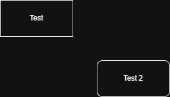

This is the introduction to the article.[^first]



## The implementation

```c
#include <stdio.h>

int main(void) {
    puts("Hello");
    return 0;
}
```

The rest of the article goes here.

[^first]: A longer explanation or an external source.