# Grand Prix Legends track viewer

Some screenshots to check that decompilation of track loading is correct.

2026-08-09 11:18 (d4a9023)

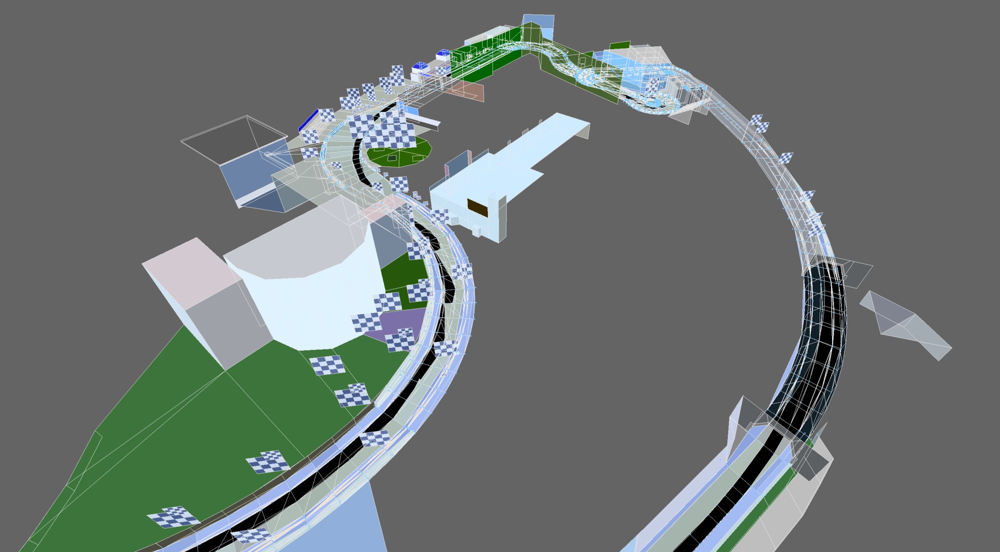

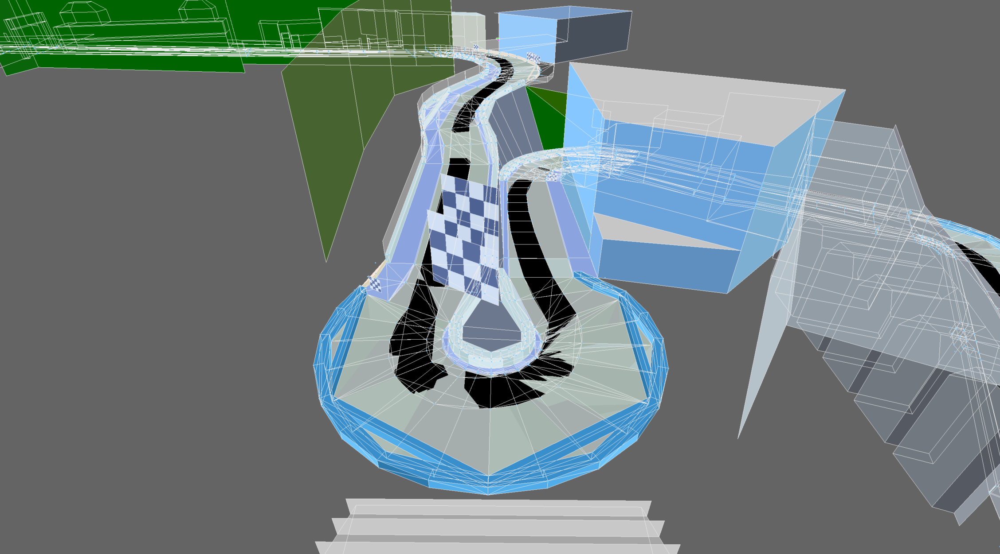

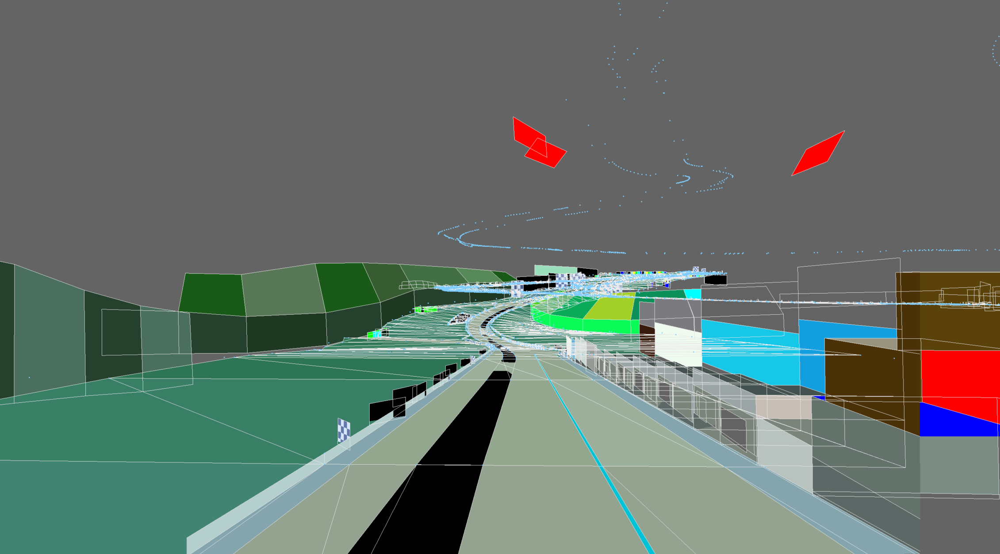

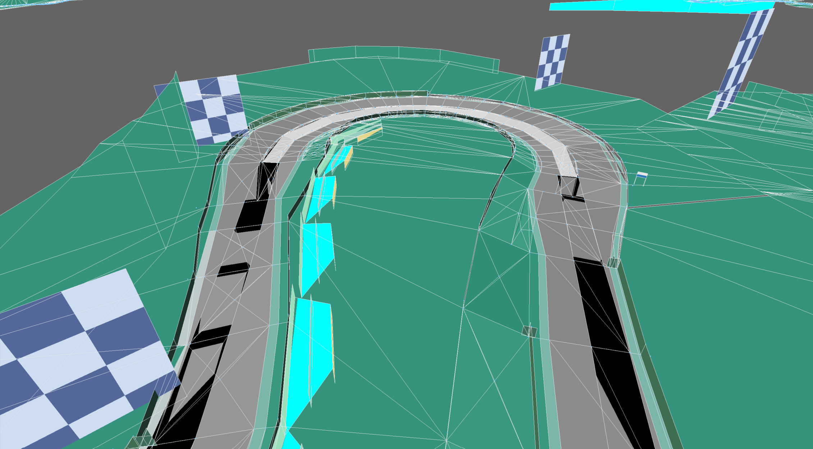

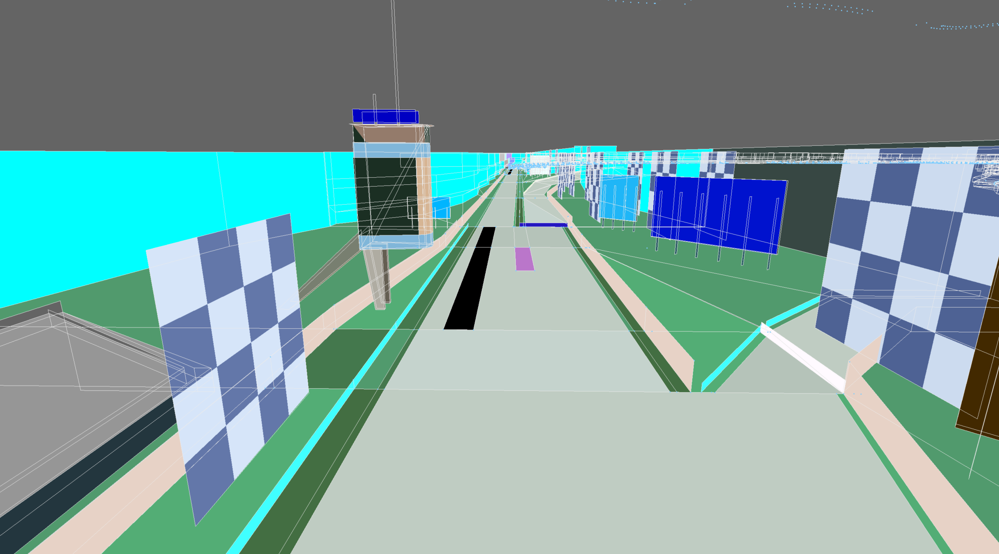

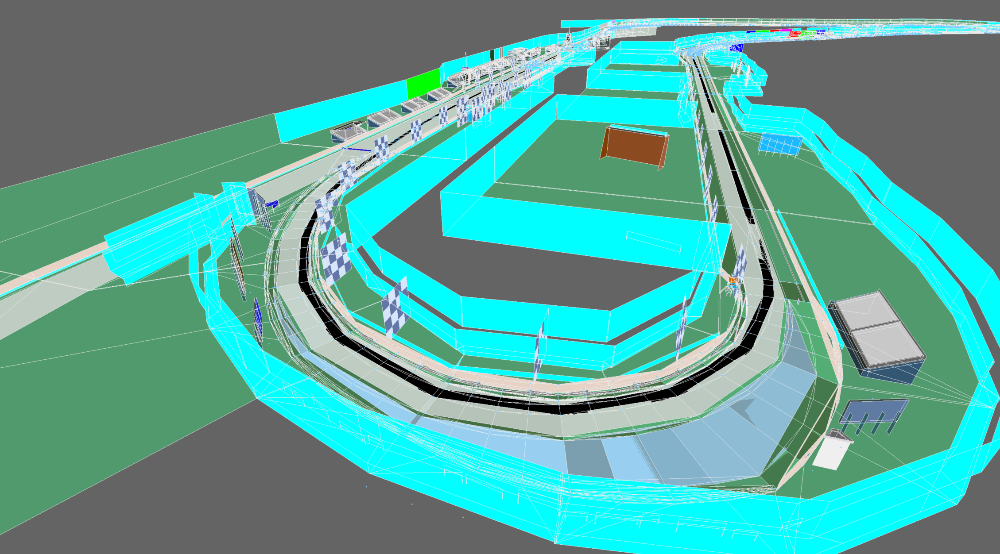

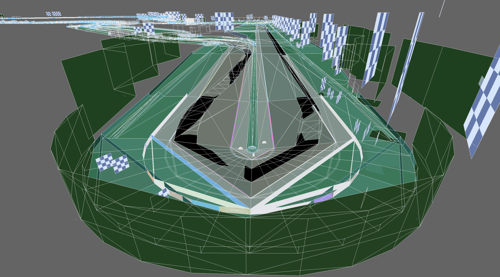

2026-08-10 10:19 (a218232)

Some textures

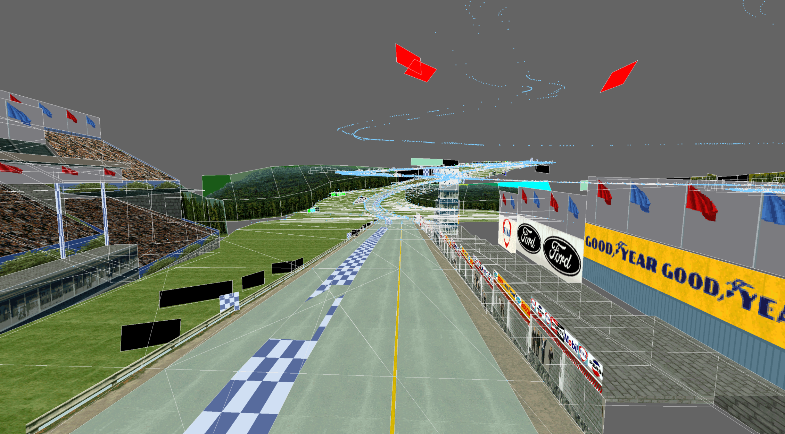

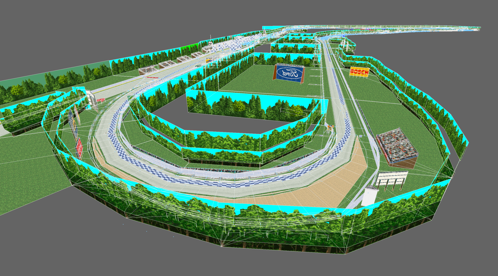

2026-08-18 19:14 (bbfc7da)

Some alpha

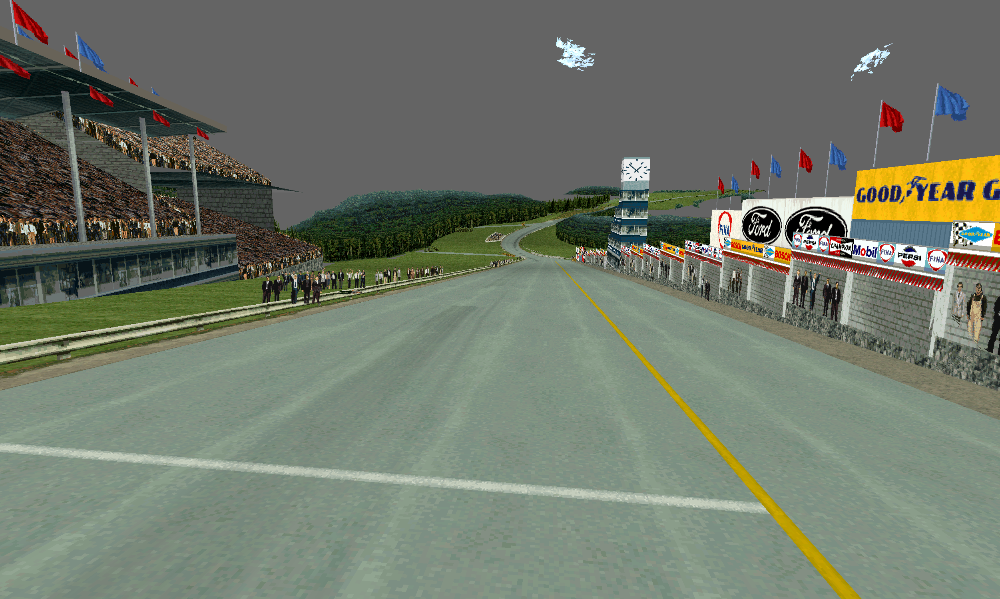

It took an embarrassing amount of time to figure out why track surface curve polygons were duplicated, where polygons were drawn between every successive vertex, every other vertex, and every fourth vertex:

Was it polygon fans going awry?  Something to do with collision mesh and visible mesh not aligning?

No, it was three LODs all being drawn at once...

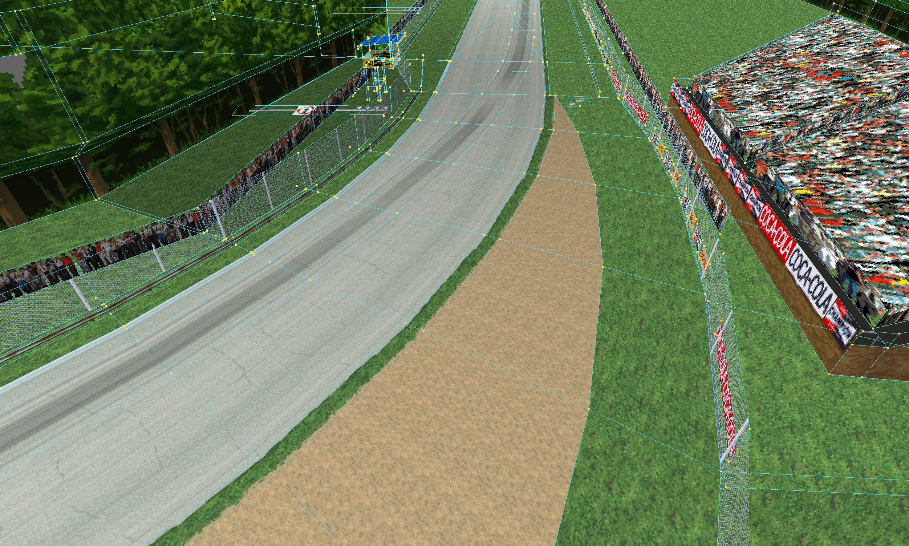

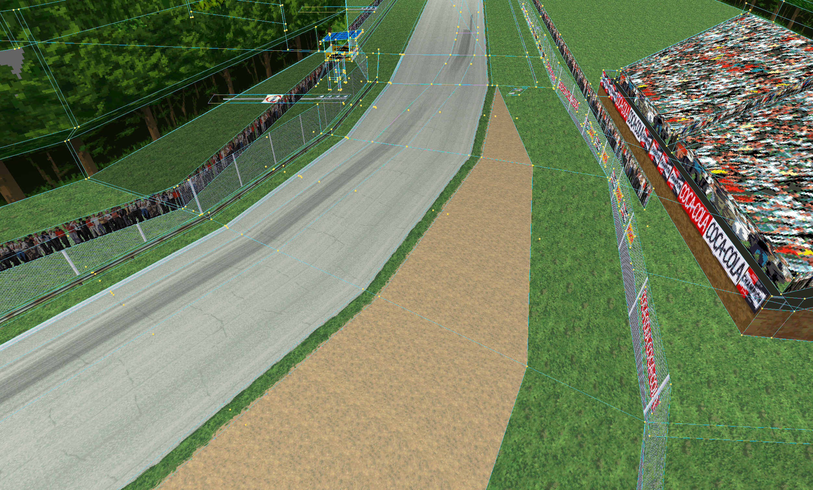

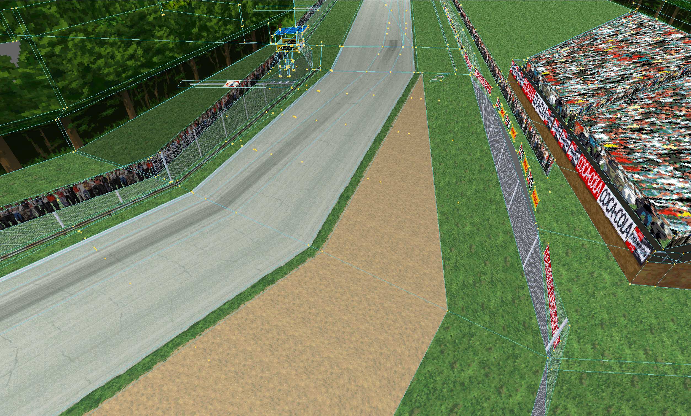

I can't think that this actually saved that much, and added the constraint that curve segments needed to be multiples of four vertices, and caused the track to visibly shift outward (away from the apex) as the camera approached.  But I basically reversed the entire rendering pipeline before the obvious answer smacked me in the face.
